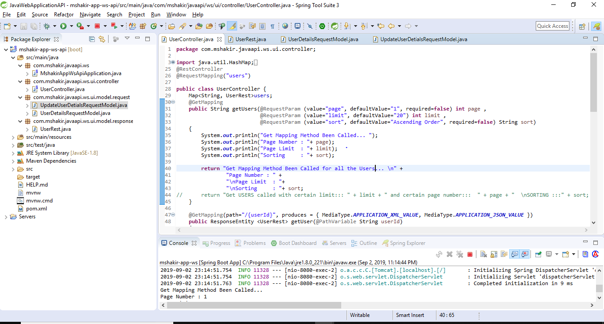
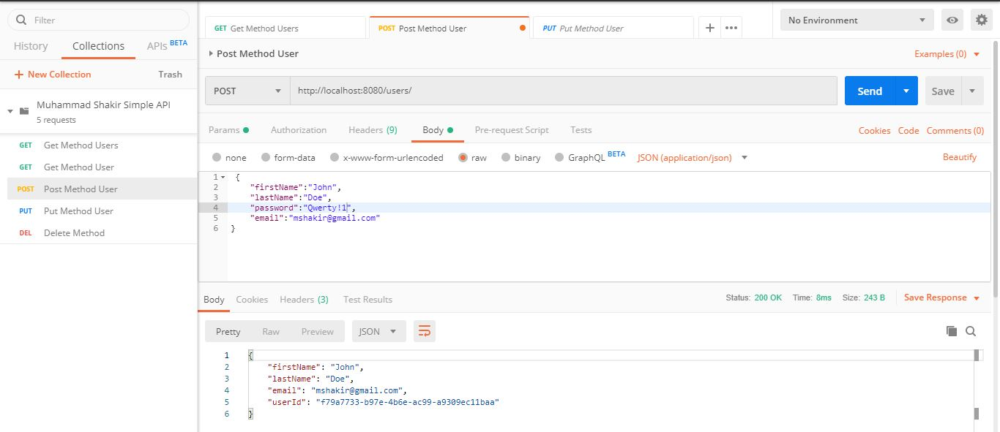
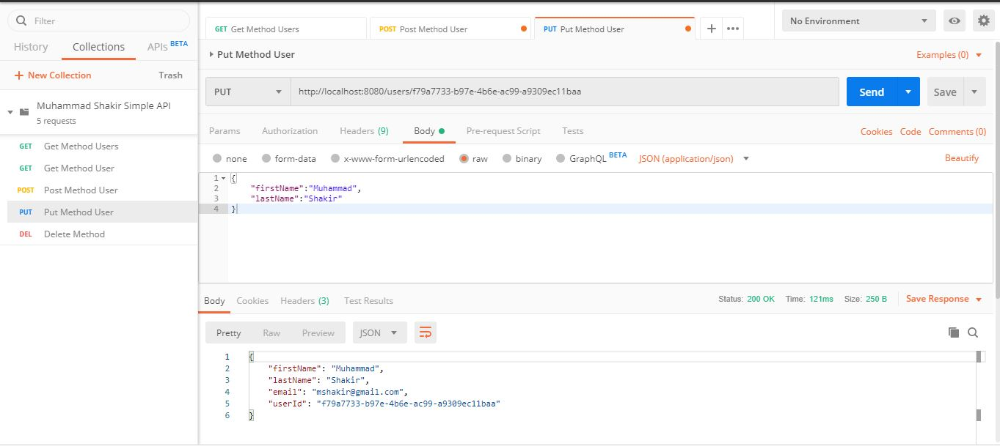
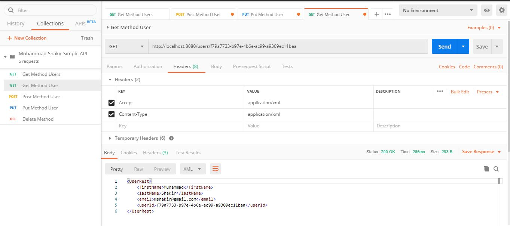

# JavaRestfulWebService
Build Restful Web Services with Java Framewrok (Spring Boot).
1. Spring Tool Suite Development Environment
2. Postman HTTP client helps to send the HTTP Requests and Receive HTTP Responses
3. Create Web Service endpoints to handle HTTP Requests: POST, GET, PUT, DELETE
4. Read and Validate URL Query String Request Parameters
5. Read and Validate HTTP Request Body
6. Handle Java Exceptions and return back a proper HTTP Response
7. Build and Run RESTful Web Service Application as a Standalone app

# What is HTTP Method
HTTP defines a set of request methods to indicate the desired action to be performed for a given resource.

###GET
The GET method requests a representation of the specified resource. Requests using GET should only retrieve data.
###HEAD
The HEAD method asks for a response identical to that of a GET request, but without the response body.
###POST
The POST method is used to submit an entity to the specified resource, often causing a change in state or side effects on the server.
###PUT
The PUT method replaces all current representations of the target resource with the request payload.
###DELETE
The DELETE method deletes the specified resource.

# What is Maven?
Maven is a powerful project managemnet tool that is based on POM. It is used for projects build, dependency, and documentation. It simplifies the build process like ANT. Maven is a build and Dependency tool which uses POM.xml file to read information about the dependencies that it needs to installed in the application or program.

## Maven does a lot of helpful task like
<li>We can easily build a project using maven.</li>
<li>We can add jars and other dependencies of the project easily using the help of maven.</li>

### Dependencies 
<li>Web Starter</li>
Full Stack Web development with Tomcat and Spring MVC

<li>XML Format</li>
XML Format dependency will help to convert Json object into XML Format if desired

#### Note
Content-Type: application/json
Accept: application/json

## Core Concepts of Maven:
POM Files: Project Object Model(POM) Files are XML file that contains information related to the project and configuration information such as dependencies, source directory, plugin, goals etc. used by Maven to build the project.

### Output RestFul Web Service

